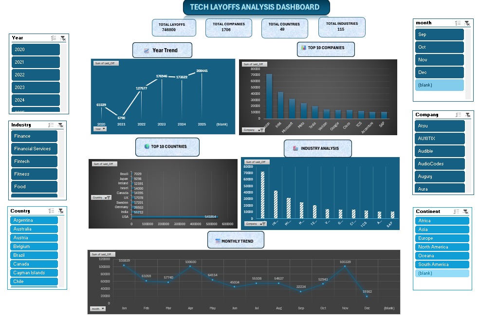

# 📊 Tech Layoffs Analysis Dashboard (2020–2025)

## 📌 Project Overview

This project presents an interactive **Microsoft Excel Dashboard** analyzing global technology layoffs from **2020 to 2025**. The dashboard transforms raw layoff data into meaningful business insights using Excel's analytical and visualization capabilities.

It enables users to explore layoff trends across companies, industries, countries, and time periods through interactive PivotTables, PivotCharts, and Slicers.

---

## 📷 Dashboard Preview



---

## 🎯 Objectives

- Analyze global technology layoffs (2020–2025)
- Identify the companies with the highest layoffs
- Compare layoffs across countries and industries
- Study yearly and monthly layoff trends
- Build an interactive Excel dashboard
- Demonstrate Excel data analysis and visualization skills

---

## 📁 Dataset Information

- **Source:** Kaggle
- **Records:** 2,412
- **Columns:** 18

The dataset includes information such as:

- Company
- Country
- Industry
- Company Stage
- Employees Laid Off
- Layoff Percentage
- Date
- Company Size
- Money Raised
- Year

---

## 🧹 Data Cleaning

The following preprocessing steps were performed:

- Converted raw data into an Excel Table
- Checked for duplicate records
- Standardized date formats
- Handled missing values appropriately
- Filled missing Stage values with **"Unknown"**
- Created helper columns for Month, Quarter, and Month Number
- Prepared data for PivotTable analysis

---

## 📊 Dashboard Features

### KPI Cards

- 👥 Total Employees Laid Off
- 🏢 Total Companies
- 🌍 Total Countries
- 🏭 Total Industries

### Visualizations

- 📈 Annual Layoffs Trend
- 🏢 Top 10 Companies by Layoffs
- 🌍 Top Countries by Layoffs
- 🏭 Industry-wise Layoffs
- 📅 Monthly Layoff Trend

### Interactive Filters

- Year
- Country
- Industry
- Month
- Continent

---

## 💡 Key Insights

- More than **746,000 employees** were laid off during the analyzed period.
- The United States recorded the highest number of layoffs.
- Layoffs peaked during **2023**.
- Multiple industries experienced significant workforce reductions.
- Interactive filters enable dynamic exploration of trends across different dimensions.

---

## 🛠️ Tools & Skills Used

**Software**

- Microsoft Excel 2024

**Excel Features**

- Pivot Tables
- Pivot Charts
- Slicers
- Excel Tables
- Data Cleaning
- Sorting & Filtering
- Excel Formulas
- Dashboard Design

---

## 📂 Repository Structure

```
Tech-Layoffs-Analysis-Excel
│
├── Dashboard
├── Dataset
├── Images
├── Presentation
├── Summary
└── README.md
```

---

## 🚀 Business Value

This dashboard helps users:

- Monitor workforce reduction trends
- Compare layoffs across companies and countries
- Identify industries most affected
- Analyze yearly and monthly patterns
- Support business reporting through interactive visualizations

---

## 👩‍💻 Author

**Swathi Krishna Suresh**

Aspiring Data Analyst passionate about transforming data into actionable business insights using Excel, SQL, Power BI, and Python.

---

⭐ If you found this project interesting, feel free to star the repository!
